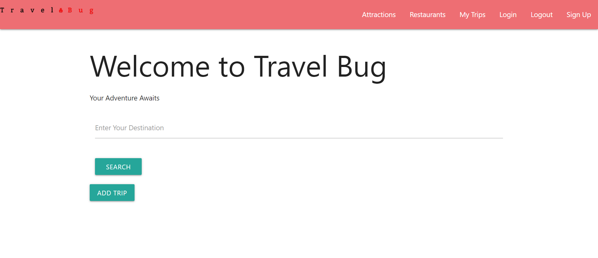

# 20React

## Description

The purpose of this project was to create a collaborative MERN-stack single-page application. By combining a scalable MongoDB back end, a GraphQL API, an Express.js and Node.js server with a React front end, implementing user authentication with JWT to build a user-focused platform.

## Installation
In order to install this repository you will need to navigate into github "https://github.com/foxeyb28/Project-3-TravelBug". 
Once you are there, look for the green code button. 
Copy the SSH link that is provided. 
Enter your local gitbash/terminal. 
Once you are in your desired destination folder. 
Type in the git clone command and paste the provided link. 

Once the repository has been cloned, open its vs code and run an integrated terminal.

Type: "npm install'

Once it has finished installing the necessary files. Type: npm run develop.

And Enjoy

## Usage
To find the github link, click [here](https://github.com/foxeyb28/Project-3-TravelBug).

To find the deployed Heroku link, click [here](https://travelbug-6245922857e9.herokuapp.com)

## Screenshot

## Credits
Adrienne Madarang, GitHub: adriennemadarang

Alicia Harris, GitHub: foxeyb28

Mackenzie Evangelista, GitHub: Erazerlista 

Enrique Pinedo, GitHub: epinedo3

## License

Please refer to the LICENSE in the repo.
